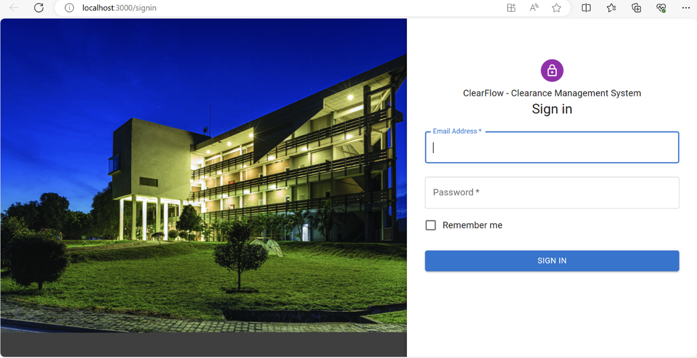
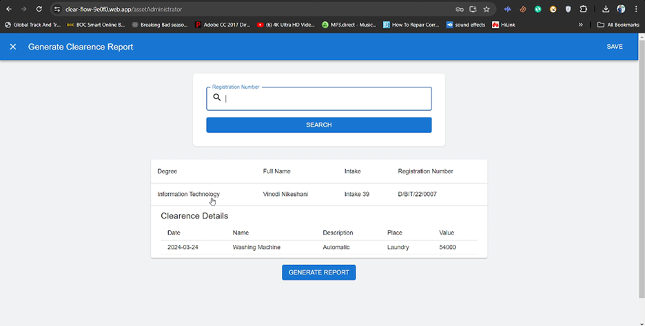
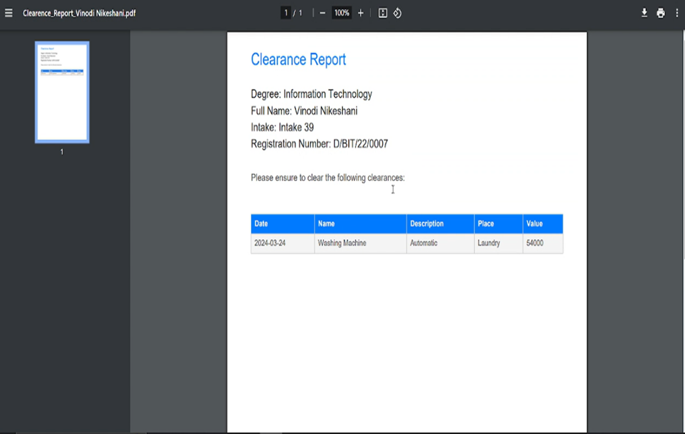
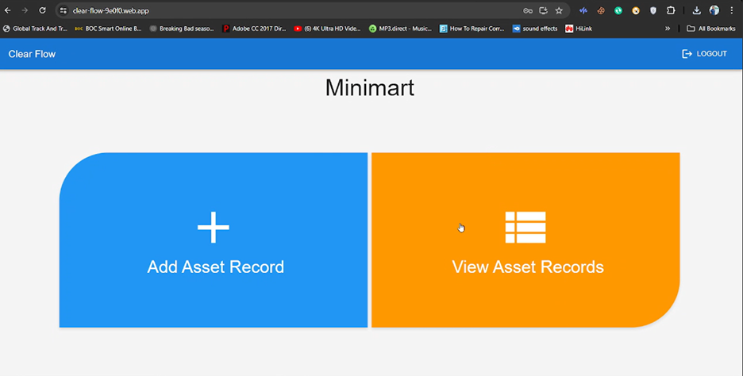

 #   Clearance management System for KDU Southern Campus
 
 ####  Developed a comprehensive Clearance Management System  for KDU Southern Campus, addressing the challenges faced by both administrators and students in manual clearance processes.

####  This web application offers a robust platform with distinct roles for administrators and clients, with clients representing heads of various campus facilities such as publications, mini marts, laundry services, gyms, etc. Clients can log in to the system to check if any students have outstanding clearance issues related to their respective facilities, streamlining the clearance verification process.
Additionally, administrators have access to comprehensive student details and can generate PDF clearance forms for individual students, providing a centralized and efficient solution for managing clearance procedures campus wide.
This system enhances transparency, reduces delays, and improves communication between administrators and facility heads, ultimately simplifying the clearance process for all stakeholders involved.

 #  Tech Stack
 ### 	• React.js
 ###  • Node.js
 ###  • Express.js
 ###  • Firebase

 # 🖥️ User Interface

###  Signin Page

###  Administrator Dashboard

###  View All Asset Records
 

###  View Asset Details

###  Generate Report

###  View PDF

###  Admini Dashboard

###  View Admin Asset Records

 

